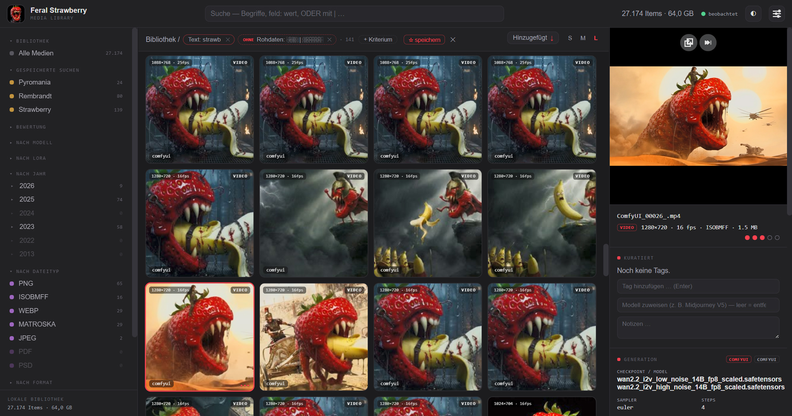

# 🍓 Feral Media Library

> 🇬🇧 **English version:** [`README.md`](README.md) · English docs:
> [`docs/en/`](docs/en/)

Die **Feral Media Library** — kurz **fml** — ist eine lokale
Medienverwaltung für **KI-generierte Bilder und Videos**. Sie ist für Bestände gebaut, an denen klassische
Foto-Tools scheitern: animierte WEBPs, WEBM-Videos und zehntausende Dateien
mit eingebetteten ComfyUI-/A1111-Workflows, Prompts und Seeds. Alles läuft
auf deinem Rechner: kein Cloud-Dienst, kein Konto, der Server ist nur unter
`127.0.0.1` erreichbar.



> **Status: Beta.** Läuft stabil im Alltagstest mit Beständen im
> sechsstelligen Bereich und ist auf 250.000+ Medien ausgelegt. Es ist ein
> Hobby-Projekt in aktiver Entwicklung - mach Backups (siehe „Gut zu
> wissen").

## Die zwei Betriebsphilosophien

fml ist **eine** Anwendung mit **zwei klar getrennten Arbeitsweisen**. Der
Unterschied ist genau einer: ob fml deine Dateien anfassen darf. Der
Schalter dafür heißt **Library-Verwaltung** (Admin → Konfiguration) und ist
ab Werk **aus**.

### 1. Übersichtsmodus (Standard): ansehen und ordnen, ohne anzufassen

Für den Fall: „Meine Medien liegen verstreut (oder bereits fertig sortiert)
auf der Platte, und ich will **Überblick, Suche und Kuratierung** - aber
niemand außer mir soll je eine Datei bewegen."

- **Hände-weg-Garantie:** fml **kopiert, verschiebt und löscht in diesem
  Modus keine einzige Datei.** Die Garantie ist serverseitig durchgesetzt -
  die entsprechenden Funktionen sind nicht versteckt, sondern gesperrt und
  erklären das auch so. Ein Badge „👁 Übersichtsmodus" in der Kopfzeile
  zeigt den Zustand.
- **Was in diesem Modus geht:** Ordner oder ganze Laufwerke
  **katalogisieren** (Aufnahme am Ort, auch dauerhaft als Watchordner),
  suchen, filtern, bewerten, taggen, Notizen schreiben, **ablehnen**
  (nimmt ein Medium nur aus dem Katalog - die Datei bleibt liegen) und per
  📂-Knopf zur Datei in den Explorer/Finder springen.
- **Was in diesem Modus bewusst nicht geht:** kopierender oder
  verschiebender Import und das Rausverschieben Abgelehnter - alles, was
  Dateien anlegt oder bewegt.

Du kannst fml in diesem Modus gefahrlos auf einen fremden oder gewachsenen
Bestand loslassen, um ihn erst einmal zu **verstehen**.

### 2. Library-Verwaltung: Wildwuchs zu einem Bestand konsolidieren

Für den Fall: „Meine Medien liegen als Wildwuchs in alten Sicherungen,
Download- und Output-Ordnern - vieles doppelt und dreifach. Ich will am
Ende **einen konsolidierten, dublettenfreien Datei-Bestand**."

- **Import kopiert - er verschiebt nie von sich aus.** Quellordner werden
  in die **Media Library** kopiert (datumsbasierte Struktur
  `JJJJ/MM/TT/`), jede Kopie wird per SHA-256 gegen die Quelle
  verifiziert, **bit-identische Dubletten werden erkannt und nicht erneut
  abgelegt**. Was mit der Quelle passiert, bestimmst du pro Import:
  Modus „kopieren" lässt sie vollständig unangetastet; Modus
  „verschieben" (eigene Sicherheitsabfrage) löscht nur, was nachweislich
  verifiziert im Bestand liegt, und lässt alle Zweifelsfälle sichtbar
  liegen. Details: [`docs/import.md`](docs/import.md).
- **Watchordner** automatisieren das: was ComfyUI & Co. dort ablegen,
  wird von selbst importiert, sobald die Datei fertig geschrieben ist.
- **Aufräumen ohne Löschtaste:** „Löschen" gibt es in fml nicht.
  **Ablehnen** nimmt ein Medium aus dem Katalog und setzt seinen Hash auf
  die Sperrliste (kommt bei keinem Import wieder herein) - die Datei
  bleibt liegen. Wer abgelehnte Dateien auch physisch aus der Library
  haben will, nutzt den einen dafür vorgesehenen Weg: **„Abgelehnte
  rausverschieben"** (Admin → Wartung) verschiebt sie hash-verifiziert in
  einen Zielordner außerhalb der Library. Endgültig entsorgen ist dann
  bewusst Sache des Dateimanagers, nicht von fml.
- **Endzustand:** ein Bestand, in dem jeder Inhalt genau einmal liegt,
  datumssortiert, vollständig katalogisiert - und die alten Quellordner
  sind nachweislich obsolet.

Beide Arbeitsweisen nutzen dieselbe Oberfläche, dieselbe Suche, dasselbe
Kuratieren. Sie lassen sich auch **kombinieren**: eine Library verwalten
und zusätzlich externe Orte nur katalogisieren - die Sidebar-Facette
„Fundort" (in der Library / nur extern) hält beides auseinander, samt
getrennter Größenangaben.

## Was fml kann - und wie es genau funktioniert

- **Identität über Inhalt:** Jedes Medium wird über seinen SHA-256-Hash
  identifiziert, nicht über den Dateipfad. Dieselbe Datei an drei Orten
  ist **ein** Item mit drei Fundorten (eine Dubletten-Ansicht listet
  genau diese Fälle). Bewertungen und Tags hängen am Inhalt und überleben
  Umbenennungen.
- **Metadaten in zwei Schichten:** Schicht 1 liest die eingebetteten
  Roh-Metadaten verlustfrei aus PNG, JPEG, WEBP, GIF, BMP, TIFF und
  Video-Containern (WEBM/MP4/MOV - auch Videos tragen ComfyUI-Workflows).
  Schicht 2 interpretiert daraus durchsuchbare Felder: Prompt, Negativ,
  Modell, LoRAs, Seed, Sampler, Steps, Eingangsbild u. a., mit Parsern
  für ComfyUI, A1111/Forge und XMP (Midjourney, Lightroom-Bewertungen).
  Weil die Rohdaten gespeichert bleiben, wirken Parser-Verbesserungen
  **rückwirkend** auf den ganzen Bestand - ohne die Dateien neu zu lesen.
- **Workflow-Ansicht:** der eingebettete ComfyUI-Workflow lässt sich als
  Node-Graph ansehen und als unverändertes `.json` herunterladen - per
  Drag&Drop direkt zurück in ComfyUI.
- **Suche als ein Zustand aus Chips:** Sidebar-Klicks (Modell, LoRA,
  Tag, Jahr, Dateityp, Format, Auflösung, Bewertung, Eingangsbild,
  Fundort), getippte Begriffe und Grammatik-Ausdrücke landen als Chips in
  **einem** kombinierbaren Suchzustand; zweimal dieselbe Facette heißt
  ODER, die Zähler links rechnen im aktiven Filter live mit. Volltext
  über Prompts, Tags, Notizen und Dateinamen antwortet auch bei 250.000
  Medien in Millisekunden. Für präzise Fälle gibt es die Grammatik
  (`model: flux | krea -tag: wip rating>=4 sort: created-ab`), und jeder
  Suchzustand lässt sich per ☆ als **gespeicherte Suche** ablegen (lädt
  als bearbeitbare Chips zurück, mit Live-Zähler in der Sidebar).
- **Seed-Varianten auf einen Klick:** Der Knopf **„🎲 Seed-Varianten
  suchen"** im Metadaten-Panel baut aus einem Bild die exakte Suche nach
  seiner Generierung - gleicher Prompt, gleiches Modell, gleiche LoRAs,
  Sampler, Steps, CFG und Größe, nur der Seed variiert. Ideal, um eine
  Seed-Serie nebeneinanderzulegen, die beste Variante zu behalten und
  den Rest abzulehnen. Jedes Kriterium liegt dabei als normaler Chip in
  der Suche und lässt sich einzeln entfernen, wenn es lockerer sein soll.
- **Galerie für große Bestände:** virtualisiertes Grid (drei Dichten),
  Vollbild-**Lupe** zum schnellen Durchblättern (←/→ mit Vorladen, Tasten
  1-5 bewerten), **Einzelbildansicht** mit echtem Zoom
  (Anpassen/50/100/200 %, Mausrad, Navigator) und breiter
  Metadaten-Spalte. Videos und animierte WEBPs spielen ab.
- **Kuratieren, auch in großen Schritten:** Bewertung, Tags, Notizen und
  manuelle Modell-Zuordnung - einzeln, per Multiselect (Shift/Strg) oder
  mit **„⚡ Sammel-Aktion" auf das komplette Suchergebnis**. Die
  Sammel-Aktionen sind bewusst nicht-destruktiv: die Basisbewertung füllt
  nur Unbewertete, Tags werden hinzugefügt, Notizen angehängt. Manuelles
  ist eine **eigene Datenschicht**, strikt getrennt von dem, was aus den
  Dateien extrahiert wurde - nichts überschreibt einander.
- **Ablehnen statt löschen:** Entf (oder die Sammel-Aktion) entfernt
  Items aus dem Katalog und sperrt ihren Hash - **die Datei wird dabei
  nie angefasst**, egal in welchem Modus. Rückgängig: Eintrag aus der
  Sperrliste entfernen (Admin) und neu aufnehmen - die extrahierten
  Metadaten kommen vollständig wieder, eigene Bewertungen/Tags des
  abgelehnten Items sind dann allerdings weg.
- **Mehrere Instanzen:** fml kann mehrfach parallel laufen - jede Instanz
  mit eigener Datenbank, eigenem Port, eigenem Namen und eigener
  Akzentfarbe. Damit bildest du aus einer konsolidierten Gesamt-Library
  **themenspezifische Subgalerien** ab, ohne die Hauptgalerie oder die
  Dateien zu berühren. Genau erklärt in
  [`docs/instanzen.md`](docs/instanzen.md).
- **Wartung ohne Angst:** Thumbnails, Suchindex, Interpretation,
  Erstelldaten - alles ist aus den Dateien und Rohdaten reproduzierbar
  und per Knopf neu erzeugbar (Admin → Wartung). Scan-Probleme (kaputte
  Dateien, fehlende Fundorte) werden gesammelt gemeldet und bleiben nach
  dem Quittieren quittiert - auch über Neustarts hinweg.

## Was fml nicht tut

- **Keine Bildbearbeitung, kein Export:** fml ist Katalog und Sichtgerät.
  Der Absprung zurück ins Erzeugen ist der Workflow-Download für ComfyUI.
- **Kein Löschen von Dateien** - in keinem Modus. Die einzigen zwei
  Stellen, an denen fml Dateien überhaupt anfasst, sind der Import und
  „Abgelehnte rausverschieben", beide nur bei eingeschalteter
  Library-Verwaltung, beide hash-verifiziert.
- **Kein Netzwerkdienst:** bindet nur an `127.0.0.1`, keine
  Benutzerverwaltung, kein Fernzugriff. Die Datenbank gehört auf eine
  lokale Platte, nicht auf ein Netzlaufwerk.
- **Kein Abgleich zwischen Instanzen oder Rechnern:** Bewertungen und
  Tags leben in der Datenbank der jeweiligen Instanz.
- **Keine KI-Analyse der Bildinhalte** (noch nicht): fml liest, was in
  den Dateien steht - es errät keine Tags aus Pixeln. Eine lokale
  VLM-Anreicherung als klar getrennte Schicht ist geplant.

## Schnellstart

**Voraussetzung:** Python 3.12+ ([python.org](https://python.org); beim
Windows-Installer „Add to PATH" anhaken). Alles Weitere passiert
automatisch.

| System | Start |
| --- | --- |
| Windows | `start.bat` doppelklicken |
| macOS / Linux | `./start.sh` im Terminal |

Der erste Start richtet die Python-Umgebung ein; der Browser öffnet sich,
sobald der Server bereit ist (Standard: **http://127.0.0.1:8765**). Für
**Video**-Metadaten und -Vorschaubilder einmalig ffmpeg installieren
(Windows: `winget install Gyan.FFmpeg`, macOS: `brew install ffmpeg`) - die
Oberfläche weist darauf hin, falls es fehlt.

### Einstieg, wenn du nur Übersicht willst (Philosophie 1)

1. Admin-Knopf (oben rechts) → **Quellen & Import** → Ordner oder
   Laufwerk wählen, Modus **„katalogisieren"**, „einmal jetzt" oder
   „dauerhaft beobachten" → **Aufnehmen**. Es wird keine Datei bewegt.
2. Stöbern: Grid, Suche oben, Filter links, Metadaten rechts. Bewerten,
   taggen, ablehnen - alles reine Katalogarbeit.

### Einstieg, wenn du konsolidieren willst (Philosophie 2)

1. Admin → **Konfiguration** → Haken bei **Library-Verwaltung**, darunter
   „Media Library (Import-Ziel)" auf einen Ordner mit genug Platz setzen.
2. Admin → **Quellen & Import** → ersten Quellordner wählen, Modus
   **„kopieren"**, „einmal jetzt" → **Aufnehmen**. Ergebnis je Datei
   steht in der Aktivität; die Quelle bleibt unangetastet, bis du dem
   Ergebnis traust.
3. Wiederholen für jede Sicherung/jeden Altordner - Dubletten erkennt der
   Import am Inhalt und legt sie nicht erneut ab.
4. Wer Quellordner danach geleert haben will, nimmt Modus „verschieben"
   (mit Sicherheitsabfrage) - gelöscht wird nur nachweislich
   Verifiziertes, Zweifelsfälle bleiben sichtbar liegen.

## Gut zu wissen (bitte lesen!)

- **Backup:** Die Datei `feral.sqlite` (neben `start.bat`, je Instanz
  eine) enthält deine Bewertungen, Tags, Notizen, gespeicherten Suchen
  und alle extrahierten Metadaten - sichere sie mit. Der Thumbnail-Cache
  (`cache/`) ist egal, der baut sich selbst neu.
- **Große Importe:** Hunderte GB sind okay - der Rechner bleibt dabei
  standardmäßig leise (Thumbnails laufen mit niedriger Priorität). Eilig?
  Admin → Konfiguration → „Volle Leistung (laut)".
- **Die Config ist eine Textdatei:** `config.toml` neben `start.bat`.
  Alles daraus ist auch in der GUI editierbar (Admin → Konfiguration);
  die kommentierte Referenz ist
  [`config.example.toml`](config.example.toml).

## Mehr Doku

[`docs/gui.md`](docs/gui.md) (Bedienung) · [`docs/import.md`](docs/import.md)
(Import & Watchordner) · [`docs/instanzen.md`](docs/instanzen.md) (mehrere
Instanzen / Subgalerien) · [`docs/admin.md`](docs/admin.md) (Admin &
Wartung) · [`docs/`](docs/) (alles Weitere)


## Mitmachen

Das öffentliche Repo erhält **Snapshot-Releases** (eine Datums-Version pro
Veröffentlichung); die laufende Entwicklung findet in einem privaten
Arbeitsrepo statt. Issues sind willkommen. Pull Requests können nur von
Hand übernommen werden - dabei kann die Commit-Zuordnung (Attribution)
verloren gehen. Wer tiefer einsteigen möchte: einfach melden - Mitarbeit
läuft über eine Einladung ins Arbeitsrepo.

---

## Für Entwickler

Voraussetzung: **Python 3.12+** (entwickelt/getestet auf 3.13).

```bash
python3.13 -m venv .venv
source .venv/bin/activate          # Windows: .venv\Scripts\activate
pip install -r requirements.txt        # Pillow, FastAPI + uvicorn
pip install -r requirements-dev.txt    # pytest
pip install -e .                       # Paket editierbar, damit `python -m feral.*` läuft
```

```bash
python -m feral.web                           # Oberfläche (Port: --port > $PORT > [web] port > 8765)
python -m feral.scan "/pfad/ordner" --db ./feral.sqlite   # CLI-Scan
python -m feral.interpret --db ./feral.sqlite # Schicht 2 rückwirkend
python -m pytest                              # Tests
```

**Immer `python -m pytest` statt nur `pytest`** - so laufen die Tests garantiert
mit dem Interpreter aus `.venv`. Falls trotzdem
`ModuleNotFoundError: No module named 'fastapi'` erscheint, kämpfen Conda und
venv um den `PATH`: `.venv/bin/python -m pytest` ist der robuste Ausweg
(oder `conda deactivate`, dann `source .venv/bin/activate`; dauerhaft:
`conda config --set auto_activate_base false`).

Code in `src/feral/`, Tests in `tests/`, Doku in `docs/`. Daten (DB, Cache,
Medien) liegen **außerhalb** des Repos (`.gitignore`).
