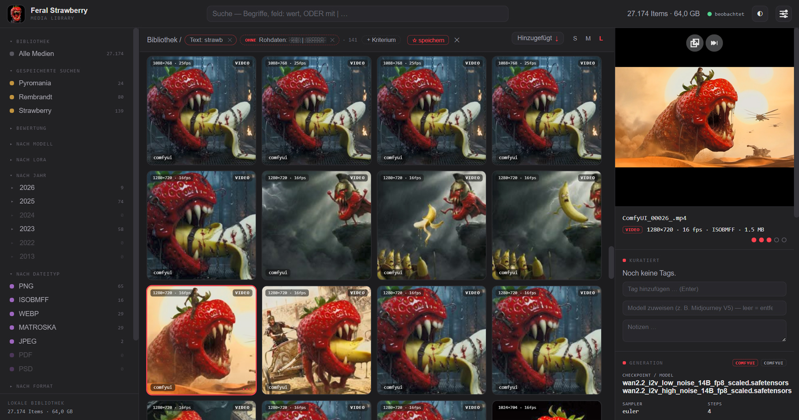

# 🍓 Feral Media Library

> 🇩🇪 Diese Übersetzung wird aus der deutschen [`README.de.md`](README.de.md)
> gepflegt — bei Widersprüchen gilt das deutsche Original.

The **Feral Media Library** — **fml** for short — is a local media
manager for **AI-generated images and videos**, and optionally for
**music** (optional audio module). It is built for collections that
classic photo tools choke on: animated WEBPs, WEBM videos, and tens of
thousands of files with embedded ComfyUI/A1111 workflows, prompts and seeds.
Everything runs on your own machine: no cloud service, no account, the
server is only reachable at `127.0.0.1`.



> **Status: Beta.** Runs stably in day-to-day testing with collections in
> the six-digit range and is designed for 250,000+ media. It is a hobby
> project under active development - make backups (see "Good to know").

## Three goals, three modes

Every intake in fml is a folder plus a **mode**. The mode alone decides
what happens to the **source**, and with it which of the three goals you
reach:

| Goal | Mode | What happens to the source | Needs |
| --- | --- | --- | --- |
| **1. Overview** | **catalog** | nothing: the media are recorded where they are | nothing |
| **2. Collect** | **copy** | stays untouched; the copy sits in the media library | library management |
| **3. Consolidate** | **move** | what has verifiably arrived is deleted from it; only doubtful cases stay visibly in place | library management, safety prompt |

Every mode comes in two **frequencies**: **once now** (the folder is
processed once) or **watch permanently** (the folder becomes a watch
folder: whatever ComfyUI & co. drop there is taken in by itself as soon
as the file has finished writing). Bit-identical duplicates are detected
by content on every path.

### Goal 1: Overview. View and organize without touching

For the case: "My media are scattered (or already neatly sorted) across the
disk, and I want **overview, search and curation** - but nobody except me
should ever move a file."

- **Hands-off guarantee:** in read-only mode (the factory default) fml
  **copies, moves and deletes not a single file.** The guarantee is
  enforced server-side - the affected functions are not hidden but locked,
  and they say so honestly. A badge "👁 Read-only mode" in the top bar
  shows the state.
- **What works:** **cataloging** folders or entire drives (once or
  permanently as watch folders), searching, filtering, rating, tagging,
  writing notes, **rejecting** (removes a medium from the catalog only -
  the file stays put) and jumping to the file in Explorer/Finder via the
  📂 button.
- **What deliberately does not work:** copy, move and moving out rejected
  files - everything that creates or moves files.

You can safely let fml loose on a foreign or organically grown collection
in this mode, just to **understand** it first.

### Goal 2: Collect. Build a library, the sources stay

For the case: "I want an organized, duplicate-free collection - but my
backups and tool folders should stay untouched until I trust the result."

- **copy** places every new file in the **media library** (date-based
  structure `YYYY/MM/DD/`), verifies the copy against the source via
  SHA-256 and does **not store bit-identical duplicates again**. The
  source is never touched; the import is read-only.
- Everyday operation: a **watch folder** in copy mode on the output folder
  of ComfyUI, A1111 & co. Whatever appears there lands in the library by
  itself, the originals stay in place.
- **End state:** the library is complete and duplicate-free, the sources
  are provably obsolete - but still there. If you want them gone, go to
  goal 3.

### Goal 3: Consolidate. One collection, no copies anywhere else

For the case: "My media are sprawled across old backups, download and
output folders - much of it duplicated two or three times. In the end I
want **a single collection**, and the old folders should be empty."

- **move** is copy plus cleanup: the same copy into the library, the same
  verification - and afterwards the file is **deleted** from the source.
  Deleted is only what verifiably sits bit-identically in the library
  with its catalog entry stored. The mode asks for explicit confirmation.
- **What remains in the source is for review,** never a loss:
  `_dubletten/` (content was already in the collection, the library copy
  was freshly verified), `_fehler/` (errors), `_unbekanntes-format/`
  (unknown format), `_gesperrt/` (rejected in fml) and `_ausgefiltert/`
  (import rules). The names are fixed identifiers and stay the same
  (German) in every language. You look at these folders and delete them
  yourself - fml never cleans up behind you.
- **In practice:** take in backup after backup with "move", or create a
  watch folder in move mode and tip the old folders into it one by one;
  "delete empty folders" removes subfolders that have become empty.
  Duplicates are detected by content, whichever backup they come from.
- **Cleaning up without a delete key:** there is no "delete" in fml.
  **Rejecting** removes a medium from the catalog and puts its hash on the
  blocklist (it will not come back in through any import) - the file stays
  put. If you also want rejected files physically out of the library, use
  the one designated path: **"Move rejected out"** (Admin → Maintenance)
  moves them, hash-verified, into a target folder outside the library.
  Final disposal is then deliberately the file manager's job, not fml's.
- **End state:** every content sits exactly once in the library, sorted by
  date, fully cataloged; the source folders are empty except for what you
  deliberately wanted to review. Details on the process and outcome
  folders: [`docs/en/import.md`](docs/en/import.md).

### The switch: library management

Goal 1 works out of the box. Goals 2 and 3 need the **Library management**
checkbox (Admin → Configuration), which is **off** by default - without it,
copy, move and moving out are locked server-side. That is the whole
difference: whether fml may touch your files. Interface, search and
curation are the same for all three goals, and they can be **combined**:
manage a library and additionally just catalog external places - the
sidebar facet "Location" (in the library / external only) keeps the two
apart, including separate size figures.

## What fml can do - and how exactly it works

- **Identity by content:** every medium is identified by its SHA-256 hash,
  not by its file path. The same file in three places is **one** item with
  three locations (a duplicates view lists exactly these cases). Ratings
  and tags attach to the content and survive renames.
- **Metadata in two layers:** layer 1 reads the embedded raw metadata
  losslessly from PNG, JPEG, WEBP, GIF, BMP, TIFF and video containers
  (WEBM/MP4/MOV - videos carry ComfyUI workflows too). Layer 2 interprets
  it into searchable fields: prompt, negative, model, LoRAs, seed,
  sampler, steps, input image and more, with parsers for ComfyUI,
  A1111/Forge and XMP (Midjourney, Lightroom ratings). Because the raw
  data is kept, parser improvements apply **retroactively** to the whole
  collection - without reading the files again.
- **Workflow view:** the embedded ComfyUI workflow can be viewed as a node
  graph and downloaded as an unmodified `.json` - drag & drop it straight
  back into ComfyUI.
- **Search as one state made of chips:** sidebar clicks (model, LoRA,
  tag, year, file type, format, resolution, rating, input image,
  location), typed terms and grammar expressions all land as chips in
  **one** combinable search state; the same facet twice means OR, and the
  counters on the left recalculate live within the active filter.
  Full-text search across prompts, tags, notes and filenames answers in
  milliseconds even with 250,000 media. For precise cases there is the
  grammar (`model: flux | krea -tag: wip rating>=4 sort: created-ab`),
  and any search state can be stored via ☆ as a **saved search** (loads
  back as editable chips, with a live counter in the sidebar).
- **Seed variants in one click:** the **"🎲 Find seed variants"** button
  in the metadata panel builds the exact search for an image's generation
  - same prompt, same model, same LoRAs, sampler, steps, CFG and size,
  only the seed varies. Ideal for laying a seed series side by side,
  keeping the best variant and rejecting the rest. Every criterion sits
  in the search as a normal chip and can be removed individually if the
  search should be looser.
- **A gallery for large collections:** virtualized grid (three
  densities), full-screen **loupe** for fast browsing (←/→ with
  preloading, keys 1-5 to rate), **single view** with real zoom
  (fit/50/100/200 %, mouse wheel, navigator) and a wide metadata column.
  Videos and animated WEBPs play.
- **Curation, also in big strokes:** rating, tags, notes and manual model
  assignment - individually, via multi-select (Shift/Ctrl) or with
  **"⚡ Bulk action" applied to the entire search result**. The bulk
  actions are deliberately non-destructive: the base rating only fills
  unrated items, tags are appended, notes are attached. Manual data is
  its **own data layer**, strictly separated from what was extracted from
  the files - nothing overwrites anything.
- **Reject instead of delete:** Del (or the bulk action) removes items
  from the catalog and blocks their hash - **the file is never touched**,
  in any mode. To undo: remove the entry from the blocklist (Admin) and
  re-ingest - the extracted metadata comes back completely; your own
  ratings/tags of the rejected item, however, are gone.
- **Audio module (optional, off by default):** music from Suno, from
  ComfyUI (YuE, ACE-Step, MiniMax) or your own recordings: MP3, FLAC, Ogg,
  WAV, AIFF, CAF, M4A, with all embedded tags, lyrics in the full-text
  search and the Suno version from the Content Credentials. A dedicated
  **audio view** shows the songs as a list with a three-colour waveform
  (bass, mids, highs) on a shared time axis, every row with its own
  playhead. The player matches loudness so the louder version does not win
  the comparison; plus **time comments** at points in a song ("Chorus" at
  1:40), **comparing** up to six versions, and **covers** from your own
  library that bring finished songs into the gallery. fml never changes
  the audio files themselves. All details:
  [`docs/en/audio.md`](docs/en/audio.md).
- **Multiple instances:** fml can run several times in parallel - each
  instance with its own database, port, name and accent color. This lets
  you carve **topic-specific sub-galleries** out of one consolidated
  master library without touching the main gallery or the files.
  Explained in detail in [`docs/en/instanzen.md`](docs/en/instanzen.md).
- **Maintenance without fear:** thumbnails, search index, interpretation,
  creation dates - everything is reproducible from the files and raw data
  and can be regenerated at the press of a button (Admin → Maintenance).
  Scan issues (broken files, missing locations) are reported collectively
  and stay acknowledged once acknowledged - across restarts too.

## What fml does not do

- **No image or audio editing, no export:** fml is a catalog and viewing
  device.
  The jump back into generation is the workflow download for ComfyUI.
- **No deleting of files** - in any mode. The only two places where fml
  touches files at all are the import and "Move rejected out", both only
  with library management enabled, both hash-verified.
- **No network service:** binds only to `127.0.0.1`, no user accounts, no
  remote access. The database belongs on a local disk, not on a network
  share.
- **No sync between instances or machines:** ratings and tags live in the
  database of their instance.
- **No AI analysis of image content** (yet): fml reads what is in the
  files - it does not guess tags from pixels. Local VLM enrichment as a
  clearly separated layer is planned.

## Quick start

**Prerequisite:** Python 3.12+ ([python.org](https://python.org); on the
Windows installer, tick "Add to PATH"). Everything else happens
automatically.

**Download:** on GitHub via the green "Code" button → "Download ZIP" and
unpack into a folder, or with Git:

```bash
git clone https://github.com/Feral-Strawberry/fml.git
```

If you know ComfyUI, you know the pattern: one folder, one start script
that sets up the Python environment the first time, then the interface
runs in your browser. An update is a new ZIP unpacked over the folder or
`git pull`; database and `config.toml` live in the same folder and are
kept.

| System | Start |
| --- | --- |
| Windows | double-click `start.bat` |
| macOS / Linux | `./start.sh` in a terminal |

The first start sets up the Python environment; the browser opens as soon
as the server is ready (default: **http://127.0.0.1:8765**). For **video**
metadata and thumbnails (and for duration, loudness and waveform in the
audio module), install ffmpeg once (Windows:
`winget install Gyan.FFmpeg`, macOS: `brew install ffmpeg`) - the
interface points it out if it is missing.

### Getting started if you only want an overview (goal 1)

1. Admin button (top right) → **Sources & import** → pick a folder or
   drive, mode **"catalog"**, "once now" or "watch permanently" →
   **Add**. No file is moved.
2. Browse: grid, search on top, filters on the left, metadata on the
   right. Rate, tag, reject - all pure catalog work.

### Getting started if you want to collect or consolidate (goals 2 and 3)

1. Admin → **Configuration** → tick **Library management**, below it set
   "Media library (import target)" to a folder with enough space.
2. Admin → **Sources & import** → pick the first source folder, mode
   **"copy"**, "once now" → **Add**. The per-file result appears under
   Activity; the source stays untouched until you trust the result.
3. Repeat for every backup/legacy folder - the import recognizes
   duplicates by content and does not store them again.
4. If you want the source folders empty (goal 3), use mode "move" (with
   safety prompt) - only what is verifiably in the collection gets
   deleted, doubtful cases stay visible in review folders and are
   disposed of by you.

## Good to know (please read!)

- **Backup:** the file `feral.sqlite` (next to `start.bat`, one per
  instance) contains your ratings, tags, notes, saved searches and all
  extracted metadata - back it up. The thumbnail cache (`cache/`) does
  not matter, it rebuilds itself.
- **Large imports:** hundreds of GB are fine - the machine stays quiet by
  default (thumbnails run at low priority). In a hurry? Admin →
  Configuration → "Full power (loud)".
- **The config is a text file:** `config.toml` next to `start.bat`.
  Everything in it can also be edited in the GUI (Admin → Configuration);
  the commented reference is
  [`config.example.toml`](config.example.toml).
- **Changed (September 2026) - sidebar click rule as in Lightroom:** a
  click selects a value (replacing the previous one of the same group),
  **Cmd/Ctrl-click adds** (OR), clicking the active value removes it.
  Before, every click widened to an OR. Details in
  [`docs/en/gui.md`](docs/en/gui.md).
- **Only named packages get installed:** the start scripts install
  exclusively the packages from `requirements.txt`, each with an exact
  version and checksum; a foreign or altered package aborts the
  installation. Which packages these are and how they are checked:
  [`DEPENDENCIES.md`](DEPENDENCIES.md) and
  [`docs/en/security.md`](docs/en/security.md).

## More documentation

[`docs/en/gui.md`](docs/en/gui.md) (using the interface) ·
[`docs/en/import.md`](docs/en/import.md) (import & watch folders) ·
[`docs/en/instanzen.md`](docs/en/instanzen.md) (multiple instances /
sub-galleries) · [`docs/en/audio.md`](docs/en/audio.md) (audio module) ·
[`docs/en/rankings.md`](docs/en/rankings.md) (rankings) ·
[`docs/en/admin.md`](docs/en/admin.md) (admin &
maintenance) · [`docs/en/architektur.md`](docs/en/architektur.md)
(technical concept) · [`docs/en/security.md`](docs/en/security.md)
(security and dependencies) · [`docs/en/`](docs/en/) (everything else)


## Contributing

The public repo receives **snapshot releases** (one dated version per
release); ongoing development happens in a private working repo. Issues
are welcome. Pull requests can only be ported over by hand - commit
attribution may get lost in the process. If you want to get more deeply
involved: just ask - collaboration works via an invitation to the
working repo.

What changed from release to release is listed in the
[`CHANGELOG.md`](CHANGELOG.md).

**About the "ADR" and issue references** in code comments and docs (e.g.
"ADR 0041", "Issue #37"): ADRs are **Architecture Decision Records** - short,
numbered entries following the pattern *context → decision →
consequences* that document every notable decision made in this project;
issue numbers point to the working repo's issue tracker. Both live in the
private working repo and are not part of the snapshots;
the references are left in place on purpose so decisions stay
traceable. If you want to know the reasoning behind a specific number:
just open an issue.

---

## For developers

Prerequisite: **Python 3.12+** (developed/tested on 3.13).

```bash
python3.13 -m venv .venv
source .venv/bin/activate          # Windows: .venv\Scripts\activate
python -m pip install --require-hashes --only-binary=:all: -r requirements-dev.txt
# make the fml sources importable (start.sh/start.bat do the same):
python -c "import pathlib, sysconfig; pathlib.Path(sysconfig.get_paths()['purelib'], 'fml-src.pth').write_text(str(pathlib.Path('src').resolve()) + '\n')"
```

`requirements-dev.txt` contains the complete runtime lock plus pytest, every
package with an exact version and hash; only what is listed there gets
installed (see [`DEPENDENCIES.md`](DEPENDENCIES.md)).

```bash
python -m feral.web                           # interface (port: --port > $PORT > [web] port > 8765)
python -m feral.scan "/path/folder" --db ./feral.sqlite   # CLI scan
python -m feral.interpret --db ./feral.sqlite # layer 2, retroactively
python -m pytest                              # tests
```

**Always `python -m pytest` instead of plain `pytest`** - that guarantees
the tests run with the interpreter from `.venv`. If you still get
`ModuleNotFoundError: No module named 'fastapi'`, Conda and venv are
fighting over your `PATH`: `.venv/bin/python -m pytest` is the robust way
out (or `conda deactivate`, then `source .venv/bin/activate`; permanently:
`conda config --set auto_activate_base false`).

Code in `src/feral/`, tests in `tests/`, docs in `docs/`. Data (DB,
cache, media) lives **outside** the repo (`.gitignore`).
