# Database schema

> What is this? The reference over all tables of `feral.sqlite`: an ER
> diagram and, per table, the columns with type, keys and indexes. For
> everyone who wants to know how fml stores its data, or who looks into
> the database directly with an SQLite tool.

The diagram and the column tables between the markers are **generated
from the real schema** (`python tools/schema_doc.py`: migrates a fresh
in-memory database and reads `sqlite_master`); a test keeps them current.
Only the explanations below are hand-written.

## How to read it

- An **item** is a content, not a path: the primary key `items.file_hash`
  is the SHA-256 of the file. The same file in three places is one item
  with three locations.
- **Solid lines** are real foreign keys (`ON DELETE` cleans up).
  **Dotted lines** are references via `file_hash` without a foreign key:
  block list, import log, watch memory and duel log must survive an item
  that leaves the catalog.
- Timestamps are ISO text in UTC. Schema changes are numbered SQL files
  under `src/feral/db/migrations/`; `PRAGMA user_version` follows along
  and the database migrates itself when opened.

```mermaid
erDiagram
  items {
    text file_hash PK
    integer file_size
    text container
    text media_kind
    text image_hash
    text first_seen_at
    text updated_at
    integer width
    integer height
    real fps
    text media_date
  }
  file_locations {
    integer id PK
    text file_hash FK
    text path
    text first_seen_at
    text last_seen_at
    integer file_size
    integer mtime_ns
  }
  raw_metadata {
    integer id PK
    text file_hash FK
    integer ordinal
    text source
    text keyword
    text value_text
    blob value_raw
    text encoding
    integer compressed
    text extracted_at
  }
  interpreted_metadata {
    integer id PK
    text file_hash FK
    text parser
    integer parser_version
    integer ordinal
    text field
    text value_text
    text interpreted_at
  }
  annotations {
    text file_hash PK, FK
    integer rating
    text notes
    text created_at
    text updated_at
    text model
  }
  tags {
    integer id PK
    text name
    text created_at
  }
  item_tags {
    text file_hash PK, FK
    integer tag_id PK, FK
    text created_at
  }
  smart_folders {
    integer id PK
    text name
    text expression
    text created_at
    text updated_at
  }
  rankings {
    integer id PK
    text name
    text expression
    text created_at
    text updated_at
  }
  ranking_duels {
    integer id PK
    integer ranking_id FK
    text winner_hash
    text loser_hash
    text created_at
    text outcome
  }
  ranking_scores {
    integer ranking_id PK, FK
    text file_hash PK
    real score
    integer duels
    text updated_at
    integer eliminated
  }
  search_index {
    any interp
    any names
    any manuell
    any negativ
    any raw
    any file_hash
  }
  blocked_hashes {
    text file_hash PK
    text reason
    text blocked_at
    text last_paths
  }
  import_log {
    integer id PK
    text imported_at
    text source_path
    text action
    text detail
    text target_path
    text file_hash
    text date_source
  }
  scan_memory {
    text path PK
    integer file_size
    integer mtime_ns
    text outcome
    text file_hash
    text last_seen_at
  }
  scan_issues {
    integer id PK
    text path
    text kind
    text message
    text first_seen_at
    text last_seen_at
    integer resolved
  }
  app_state {
    text key PK
    text value
    text updated_at
  }
  items ||--o{ file_locations : "file_hash"
  items ||--o{ raw_metadata : "file_hash"
  items ||--o{ interpreted_metadata : "file_hash"
  items ||--o| annotations : "file_hash"
  tags ||--o{ item_tags : "tag_id"
  items ||--o{ item_tags : "file_hash"
  rankings ||--o{ ranking_duels : "ranking_id"
  rankings ||--o{ ranking_scores : "ranking_id"
  items |o..o{ ranking_scores : "file_hash"
  items |o..o{ ranking_duels : "winner / loser"
  items |o..o| search_index : "file_hash"
  items |o..o| blocked_hashes : "file_hash"
  items |o..o{ import_log : "file_hash"
  items |o..o{ scan_memory : "file_hash"
```

<!-- schema:start -->

### Hub: identity and locations

#### `items` · PK `file_hash`

| Column | Type | Key | Required | Default |
| --- | --- | --- | --- | --- |
| `file_hash` | text | PK | yes |  |
| `file_size` | integer |  | yes |  |
| `container` | text |  | yes |  |
| `media_kind` | text |  | yes |  |
| `image_hash` | text |  |  |  |
| `first_seen_at` | text |  | yes |  |
| `updated_at` | text |  | yes |  |
| `width` | integer |  |  |  |
| `height` | integer |  |  |  |
| `fps` | real |  |  |  |
| `media_date` | text |  |  |  |

Indexes: `idx_items_container`, `idx_items_first_seen`, `idx_items_media_date`, `idx_items_size`

#### `file_locations` · PK `id`

| Column | Type | Key | Required | Default |
| --- | --- | --- | --- | --- |
| `id` | integer | PK |  |  |
| `file_hash` | text | FK → `items.file_hash` | yes |  |
| `path` | text |  | yes |  |
| `first_seen_at` | text |  | yes |  |
| `last_seen_at` | text |  | yes |  |
| `file_size` | integer |  |  |  |
| `mtime_ns` | integer |  |  |  |

Indexes: `idx_file_locations_hash`, `idx_file_locations_path`, `idx_loc_basename`

### Layer 1: raw extraction

#### `raw_metadata` · PK `id`

| Column | Type | Key | Required | Default |
| --- | --- | --- | --- | --- |
| `id` | integer | PK |  |  |
| `file_hash` | text | FK → `items.file_hash` | yes |  |
| `ordinal` | integer |  | yes |  |
| `source` | text |  | yes |  |
| `keyword` | text |  |  |  |
| `value_text` | text |  |  |  |
| `value_raw` | blob |  | yes |  |
| `encoding` | text |  | yes |  |
| `compressed` | integer |  | yes | `0` |
| `extracted_at` | text |  | yes |  |

Indexes: `idx_raw_metadata_hash`, `idx_raw_metadata_keyword`

### Layer 2: interpretation

#### `interpreted_metadata` · PK `id`

| Column | Type | Key | Required | Default |
| --- | --- | --- | --- | --- |
| `id` | integer | PK |  |  |
| `file_hash` | text | FK → `items.file_hash` | yes |  |
| `parser` | text |  | yes |  |
| `parser_version` | integer |  | yes |  |
| `ordinal` | integer |  | yes |  |
| `field` | text |  | yes |  |
| `value_text` | text |  | yes |  |
| `interpreted_at` | text |  | yes |  |

Indexes: `idx_interpreted_field_value`, `idx_interpreted_hash`

### Manual layer

#### `annotations` · PK `file_hash`

| Column | Type | Key | Required | Default |
| --- | --- | --- | --- | --- |
| `file_hash` | text | PK · FK → `items.file_hash` | yes |  |
| `rating` | integer |  |  |  |
| `notes` | text |  |  |  |
| `created_at` | text |  | yes |  |
| `updated_at` | text |  | yes |  |
| `model` | text |  |  |  |

Indexes: `idx_annotations_rating`

#### `tags` · PK `id`

| Column | Type | Key | Required | Default |
| --- | --- | --- | --- | --- |
| `id` | integer | PK |  |  |
| `name` | text |  | yes |  |
| `created_at` | text |  | yes |  |

Indexes: none

#### `item_tags` · PK `file_hash, tag_id`

| Column | Type | Key | Required | Default |
| --- | --- | --- | --- | --- |
| `file_hash` | text | PK · FK → `items.file_hash` | yes |  |
| `tag_id` | integer | PK · FK → `tags.id` | yes |  |
| `created_at` | text |  | yes |  |

Indexes: `idx_item_tags_tag`

#### `smart_folders` · PK `id`

| Column | Type | Key | Required | Default |
| --- | --- | --- | --- | --- |
| `id` | integer | PK |  |  |
| `name` | text |  | yes |  |
| `expression` | text |  | yes |  |
| `created_at` | text |  | yes |  |
| `updated_at` | text |  | yes |  |

Indexes: none

### Ranking module

#### `rankings` · PK `id`

| Column | Type | Key | Required | Default |
| --- | --- | --- | --- | --- |
| `id` | integer | PK |  |  |
| `name` | text |  | yes |  |
| `expression` | text |  | yes |  |
| `created_at` | text |  | yes |  |
| `updated_at` | text |  | yes |  |

Indexes: none

#### `ranking_duels` · PK `id`

| Column | Type | Key | Required | Default |
| --- | --- | --- | --- | --- |
| `id` | integer | PK |  |  |
| `ranking_id` | integer | FK → `rankings.id` | yes |  |
| `winner_hash` | text |  | yes |  |
| `loser_hash` | text |  | yes |  |
| `created_at` | text |  | yes |  |
| `outcome` | text |  | yes | `'sieg'` |

Indexes: `idx_ranking_duels_replay`

#### `ranking_scores` · PK `ranking_id, file_hash`

| Column | Type | Key | Required | Default |
| --- | --- | --- | --- | --- |
| `ranking_id` | integer | PK · FK → `rankings.id` | yes |  |
| `file_hash` | text | PK | yes |  |
| `score` | real |  | yes |  |
| `duels` | integer |  | yes |  |
| `updated_at` | text |  | yes |  |
| `eliminated` | integer |  | yes | `0` |

Indexes: `idx_ranking_scores_order`, `idx_ranking_scores_pool`

### Full-text index

#### `search_index` · FTS5 table (virtual), tokenizer `unicode61`

| Column | Type | Key | Required | Default |
| --- | --- | --- | --- | --- |
| `interp` |  |  |  |  |
| `names` |  |  |  |  |
| `manuell` |  |  |  |  |
| `negativ` |  |  |  |  |
| `raw` |  |  |  |  |
| `file_hash` |  | unindexed |  |  |

Indexes: none

### Operations

#### `blocked_hashes` · PK `file_hash`

| Column | Type | Key | Required | Default |
| --- | --- | --- | --- | --- |
| `file_hash` | text | PK | yes |  |
| `reason` | text |  |  |  |
| `blocked_at` | text |  | yes |  |
| `last_paths` | text |  |  |  |

Indexes: none

#### `import_log` · PK `id`

| Column | Type | Key | Required | Default |
| --- | --- | --- | --- | --- |
| `id` | integer | PK |  |  |
| `imported_at` | text |  | yes |  |
| `source_path` | text |  | yes |  |
| `action` | text |  | yes |  |
| `detail` | text |  |  |  |
| `target_path` | text |  |  |  |
| `file_hash` | text |  |  |  |
| `date_source` | text |  |  |  |

Indexes: `idx_import_log_action`

#### `scan_memory` · PK `path`

| Column | Type | Key | Required | Default |
| --- | --- | --- | --- | --- |
| `path` | text | PK |  |  |
| `file_size` | integer |  | yes |  |
| `mtime_ns` | integer |  | yes |  |
| `outcome` | text |  | yes |  |
| `file_hash` | text |  |  |  |
| `last_seen_at` | text |  | yes |  |

Indexes: `idx_scan_memory_hash`

#### `scan_issues` · PK `id`

| Column | Type | Key | Required | Default |
| --- | --- | --- | --- | --- |
| `id` | integer | PK |  |  |
| `path` | text |  | yes |  |
| `kind` | text |  | yes |  |
| `message` | text |  | yes |  |
| `first_seen_at` | text |  | yes |  |
| `last_seen_at` | text |  | yes |  |
| `resolved` | integer |  | yes | `0` |

Indexes: `idx_scan_issues_open`

#### `app_state` · PK `key`

| Column | Type | Key | Required | Default |
| --- | --- | --- | --- | --- |
| `key` | text | PK |  |  |
| `value` | text |  | yes |  |
| `updated_at` | text |  | yes |  |

Indexes: none
<!-- schema:ende -->

## The layers, explained

**Hub: identity and locations.** `items` holds one row per unique file
with size, container, media kind, dimensions, fps and the creation date
(`media_date`, `NULL` = no plausible date). `file_locations` are the paths
where fml knows the file, with size and modification time for the size
guard; the expression index on the base name serves the `file:` search.

**Layer 1: raw extraction.** `raw_metadata` stores every metadata entry
byte for byte (`value_raw`) with a source label (`png:tEXt`, `jpeg:APP11`,
`isobmff:stream0` …), keyword and, where possible, decoded text. Layer 2
can be recomputed from this table at any time without touching a file
(Admin → Maintenance → "Re-interpret").

**Layer 2: interpretation.** `interpreted_metadata` are key-value rows in
the canonical field vocabulary (`prompt`, `model`, `seed`, `lora`, `tool`,
`video_codec` …), per parser with version; `ordinal` carries multiple
values (several LoRAs, several sampler passes). The covering index over
`(field, value_text, file_hash)` serves facets and chip filters.

**Manual layer.** What a person sets, strictly separated from the
extracted: `annotations` (exactly one row per item: rating 1–5, notes,
manual model that overrides the detected one in facet and filter), `tags`
and `item_tags` (vocabulary and assignment), `smart_folders` (saved
searches: name plus filter expression, the sort order is part of the
expression).

**Ranking module.** `rankings` is a named search that duels run over.
`ranking_duels` is the append-only duel log and the raw truth (`outcome`:
`sieg` = win, `beide_verloren` = both lost, `zurueck` = reinstated);
`ranking_scores` are derived from it (Elo from 1000, duel count,
`eliminated` for "Both out") and can be reproduced by replay at any time
(Admin → Rankings → "Recompute ranking scores"). Winner and loser are
stored as hashes without a foreign key: the duel history stays when an
item is rejected.

**Full-text index.** `search_index` is an FTS5 table with five columns so
the default search can deliberately leave out what users do not mean:
`interp` (layer-2 values without the negative prompt), `names` (base names
of the locations), `manuell` (tags, notes, manual model), `negativ` (only
via `negative_prompt:`), `raw` (raw texts, only via `raw:`). Can be rebuilt
at any time (Admin → Maintenance → "Rebuild search index").

**Operations.** `blocked_hashes` is the block list of rejected media with
reason and the last known paths (for moving out). `import_log` records
every file touched by import or move-out with outcome, target, hash and
date source. `scan_memory` remembers size and modification time of files
cataloged by watch folders so restarts skip the unchanged. `scan_issues`
are the issues from Admin → Issues (`kind`: `failed`, `warning`,
`thumbnail`, `playback`; `resolved` = acknowledged). `app_state` is a small
key-value store for remembered admin figures with the machine's origin
stamp.

How data is stored and queried, with example queries:
[persistence.md](persistence.md).
