# Datenbank-Schema

> Was ist das? Die Referenz über alle Tabellen der `feral.sqlite`: ein
> ER-Diagramm und je Tabelle die Spalten mit Typ, Schlüssel und Indexen.
> Für alle, die wissen wollen, wie fml seine Daten ablegt, oder die mit
> einem SQLite-Werkzeug direkt in die Datenbank schauen.

Diagramm und Spaltentabellen zwischen den Markern werden **aus dem echten
Schema erzeugt** (`python tools/schema_doc.py`: migriert eine frische
Datenbank im Speicher und liest `sqlite_master`); ein Test hält sie
aktuell. Handgeschrieben sind nur die Erläuterungen darunter.

## Lesehilfe

- Ein **Item** ist ein Inhalt, nicht ein Pfad: Der Primärschlüssel
  `items.file_hash` ist der SHA-256 der Datei. Dieselbe Datei an drei
  Orten ist ein Item mit drei Fundorten.
- **Durchgezogene Linien** sind echte Fremdschlüssel (`ON DELETE` räumt
  mit auf). **Gestrichelte Linien** sind Verweise über `file_hash` ohne
  Fremdschlüssel: Sperrliste, Import-Log, Watch-Gedächtnis und Duell-Log
  müssen ein Item überleben, das aus dem Katalog verschwindet.
- Zeitstempel sind ISO-Text in UTC. Schema-Änderungen sind nummerierte
  SQL-Dateien unter `src/feral/db/migrations/`; `PRAGMA user_version`
  läuft mit und die Datenbank migriert sich beim Öffnen selbst.

```mermaid
erDiagram
  items {
    text file_hash PK
    integer file_size
    text container
    text media_kind
    text image_hash
    text first_seen_at
    text updated_at
    integer width
    integer height
    real fps
    text media_date
  }
  file_locations {
    integer id PK
    text file_hash FK
    text path
    text first_seen_at
    text last_seen_at
    integer file_size
    integer mtime_ns
  }
  raw_metadata {
    integer id PK
    text file_hash FK
    integer ordinal
    text source
    text keyword
    text value_text
    blob value_raw
    text encoding
    integer compressed
    text extracted_at
  }
  interpreted_metadata {
    integer id PK
    text file_hash FK
    text parser
    integer parser_version
    integer ordinal
    text field
    text value_text
    text interpreted_at
  }
  annotations {
    text file_hash PK, FK
    integer rating
    text notes
    text created_at
    text updated_at
    text model
  }
  tags {
    integer id PK
    text name
    text created_at
  }
  item_tags {
    text file_hash PK, FK
    integer tag_id PK, FK
    text created_at
  }
  smart_folders {
    integer id PK
    text name
    text expression
    text created_at
    text updated_at
  }
  rankings {
    integer id PK
    text name
    text expression
    text created_at
    text updated_at
  }
  ranking_duels {
    integer id PK
    integer ranking_id FK
    text winner_hash
    text loser_hash
    text created_at
    text outcome
  }
  ranking_scores {
    integer ranking_id PK, FK
    text file_hash PK
    real score
    integer duels
    text updated_at
    integer eliminated
  }
  search_index {
    any interp
    any names
    any manuell
    any negativ
    any raw
    any file_hash
  }
  blocked_hashes {
    text file_hash PK
    text reason
    text blocked_at
    text last_paths
  }
  import_log {
    integer id PK
    text imported_at
    text source_path
    text action
    text detail
    text target_path
    text file_hash
    text date_source
  }
  scan_memory {
    text path PK
    integer file_size
    integer mtime_ns
    text outcome
    text file_hash
    text last_seen_at
  }
  scan_issues {
    integer id PK
    text path
    text kind
    text message
    text first_seen_at
    text last_seen_at
    integer resolved
  }
  app_state {
    text key PK
    text value
    text updated_at
  }
  items ||--o{ file_locations : "file_hash"
  items ||--o{ raw_metadata : "file_hash"
  items ||--o{ interpreted_metadata : "file_hash"
  items ||--o| annotations : "file_hash"
  tags ||--o{ item_tags : "tag_id"
  items ||--o{ item_tags : "file_hash"
  rankings ||--o{ ranking_duels : "ranking_id"
  rankings ||--o{ ranking_scores : "ranking_id"
  items |o..o{ ranking_scores : "file_hash"
  items |o..o{ ranking_duels : "winner / loser"
  items |o..o| search_index : "file_hash"
  items |o..o| blocked_hashes : "file_hash"
  items |o..o{ import_log : "file_hash"
  items |o..o{ scan_memory : "file_hash"
```

<!-- schema:start -->

### Hub: Identität und Fundorte

#### `items` · PK `file_hash`

| Spalte | Typ | Schlüssel | Pflicht | Standard |
| --- | --- | --- | --- | --- |
| `file_hash` | text | PK | ja |  |
| `file_size` | integer |  | ja |  |
| `container` | text |  | ja |  |
| `media_kind` | text |  | ja |  |
| `image_hash` | text |  |  |  |
| `first_seen_at` | text |  | ja |  |
| `updated_at` | text |  | ja |  |
| `width` | integer |  |  |  |
| `height` | integer |  |  |  |
| `fps` | real |  |  |  |
| `media_date` | text |  |  |  |

Indexe: `idx_items_container`, `idx_items_first_seen`, `idx_items_media_date`, `idx_items_size`

#### `file_locations` · PK `id`

| Spalte | Typ | Schlüssel | Pflicht | Standard |
| --- | --- | --- | --- | --- |
| `id` | integer | PK |  |  |
| `file_hash` | text | FK → `items.file_hash` | ja |  |
| `path` | text |  | ja |  |
| `first_seen_at` | text |  | ja |  |
| `last_seen_at` | text |  | ja |  |
| `file_size` | integer |  |  |  |
| `mtime_ns` | integer |  |  |  |

Indexe: `idx_file_locations_hash`, `idx_file_locations_path`, `idx_loc_basename`

### Schicht 1: Roh-Extraktion

#### `raw_metadata` · PK `id`

| Spalte | Typ | Schlüssel | Pflicht | Standard |
| --- | --- | --- | --- | --- |
| `id` | integer | PK |  |  |
| `file_hash` | text | FK → `items.file_hash` | ja |  |
| `ordinal` | integer |  | ja |  |
| `source` | text |  | ja |  |
| `keyword` | text |  |  |  |
| `value_text` | text |  |  |  |
| `value_raw` | blob |  | ja |  |
| `encoding` | text |  | ja |  |
| `compressed` | integer |  | ja | `0` |
| `extracted_at` | text |  | ja |  |

Indexe: `idx_raw_metadata_hash`, `idx_raw_metadata_keyword`

### Schicht 2: Interpretation

#### `interpreted_metadata` · PK `id`

| Spalte | Typ | Schlüssel | Pflicht | Standard |
| --- | --- | --- | --- | --- |
| `id` | integer | PK |  |  |
| `file_hash` | text | FK → `items.file_hash` | ja |  |
| `parser` | text |  | ja |  |
| `parser_version` | integer |  | ja |  |
| `ordinal` | integer |  | ja |  |
| `field` | text |  | ja |  |
| `value_text` | text |  | ja |  |
| `interpreted_at` | text |  | ja |  |

Indexe: `idx_interpreted_field_value`, `idx_interpreted_hash`

### Manuelle Schicht

#### `annotations` · PK `file_hash`

| Spalte | Typ | Schlüssel | Pflicht | Standard |
| --- | --- | --- | --- | --- |
| `file_hash` | text | PK · FK → `items.file_hash` | ja |  |
| `rating` | integer |  |  |  |
| `notes` | text |  |  |  |
| `created_at` | text |  | ja |  |
| `updated_at` | text |  | ja |  |
| `model` | text |  |  |  |

Indexe: `idx_annotations_rating`

#### `tags` · PK `id`

| Spalte | Typ | Schlüssel | Pflicht | Standard |
| --- | --- | --- | --- | --- |
| `id` | integer | PK |  |  |
| `name` | text |  | ja |  |
| `created_at` | text |  | ja |  |

Indexe: keine

#### `item_tags` · PK `file_hash, tag_id`

| Spalte | Typ | Schlüssel | Pflicht | Standard |
| --- | --- | --- | --- | --- |
| `file_hash` | text | PK · FK → `items.file_hash` | ja |  |
| `tag_id` | integer | PK · FK → `tags.id` | ja |  |
| `created_at` | text |  | ja |  |

Indexe: `idx_item_tags_tag`

#### `smart_folders` · PK `id`

| Spalte | Typ | Schlüssel | Pflicht | Standard |
| --- | --- | --- | --- | --- |
| `id` | integer | PK |  |  |
| `name` | text |  | ja |  |
| `expression` | text |  | ja |  |
| `created_at` | text |  | ja |  |
| `updated_at` | text |  | ja |  |

Indexe: keine

### Ranking-Modul

#### `rankings` · PK `id`

| Spalte | Typ | Schlüssel | Pflicht | Standard |
| --- | --- | --- | --- | --- |
| `id` | integer | PK |  |  |
| `name` | text |  | ja |  |
| `expression` | text |  | ja |  |
| `created_at` | text |  | ja |  |
| `updated_at` | text |  | ja |  |

Indexe: keine

#### `ranking_duels` · PK `id`

| Spalte | Typ | Schlüssel | Pflicht | Standard |
| --- | --- | --- | --- | --- |
| `id` | integer | PK |  |  |
| `ranking_id` | integer | FK → `rankings.id` | ja |  |
| `winner_hash` | text |  | ja |  |
| `loser_hash` | text |  | ja |  |
| `created_at` | text |  | ja |  |
| `outcome` | text |  | ja | `'sieg'` |

Indexe: `idx_ranking_duels_replay`

#### `ranking_scores` · PK `ranking_id, file_hash`

| Spalte | Typ | Schlüssel | Pflicht | Standard |
| --- | --- | --- | --- | --- |
| `ranking_id` | integer | PK · FK → `rankings.id` | ja |  |
| `file_hash` | text | PK | ja |  |
| `score` | real |  | ja |  |
| `duels` | integer |  | ja |  |
| `updated_at` | text |  | ja |  |
| `eliminated` | integer |  | ja | `0` |

Indexe: `idx_ranking_scores_order`, `idx_ranking_scores_pool`

### Volltextindex

#### `search_index` · FTS5-Tabelle (virtuell), Tokenizer `unicode61`

| Spalte | Typ | Schlüssel | Pflicht | Standard |
| --- | --- | --- | --- | --- |
| `interp` |  |  |  |  |
| `names` |  |  |  |  |
| `manuell` |  |  |  |  |
| `negativ` |  |  |  |  |
| `raw` |  |  |  |  |
| `file_hash` |  | nicht indiziert |  |  |

Indexe: keine

### Betrieb

#### `blocked_hashes` · PK `file_hash`

| Spalte | Typ | Schlüssel | Pflicht | Standard |
| --- | --- | --- | --- | --- |
| `file_hash` | text | PK | ja |  |
| `reason` | text |  |  |  |
| `blocked_at` | text |  | ja |  |
| `last_paths` | text |  |  |  |

Indexe: keine

#### `import_log` · PK `id`

| Spalte | Typ | Schlüssel | Pflicht | Standard |
| --- | --- | --- | --- | --- |
| `id` | integer | PK |  |  |
| `imported_at` | text |  | ja |  |
| `source_path` | text |  | ja |  |
| `action` | text |  | ja |  |
| `detail` | text |  |  |  |
| `target_path` | text |  |  |  |
| `file_hash` | text |  |  |  |
| `date_source` | text |  |  |  |

Indexe: `idx_import_log_action`

#### `scan_memory` · PK `path`

| Spalte | Typ | Schlüssel | Pflicht | Standard |
| --- | --- | --- | --- | --- |
| `path` | text | PK |  |  |
| `file_size` | integer |  | ja |  |
| `mtime_ns` | integer |  | ja |  |
| `outcome` | text |  | ja |  |
| `file_hash` | text |  |  |  |
| `last_seen_at` | text |  | ja |  |

Indexe: `idx_scan_memory_hash`

#### `scan_issues` · PK `id`

| Spalte | Typ | Schlüssel | Pflicht | Standard |
| --- | --- | --- | --- | --- |
| `id` | integer | PK |  |  |
| `path` | text |  | ja |  |
| `kind` | text |  | ja |  |
| `message` | text |  | ja |  |
| `first_seen_at` | text |  | ja |  |
| `last_seen_at` | text |  | ja |  |
| `resolved` | integer |  | ja | `0` |

Indexe: `idx_scan_issues_open`

#### `app_state` · PK `key`

| Spalte | Typ | Schlüssel | Pflicht | Standard |
| --- | --- | --- | --- | --- |
| `key` | text | PK |  |  |
| `value` | text |  | ja |  |
| `updated_at` | text |  | ja |  |

Indexe: keine
<!-- schema:ende -->

## Die Schichten, erklärt

**Hub: Identität und Fundorte.** `items` hält je einzigartiger Datei eine
Zeile mit Größe, Container, Medienart, Maßen, fps und dem Erstelldatum
(`media_date`, `NULL` = kein plausibles Datum). `file_locations` sind die
Pfade, an denen fml die Datei kennt, mit Größe und Änderungszeit für den
Größen-Wächter; der Expression-Index auf dem Basenamen bedient die Suche
`datei:`.

**Schicht 1: Roh-Extraktion.** `raw_metadata` speichert jeden Metadaten-
Eintrag byte-treu (`value_raw`) mit Quell-Label (`png:tEXt`, `jpeg:APP11`,
`isobmff:stream0` …), Keyword und, wo möglich, dekodiertem Text. Aus
dieser Tabelle lässt sich Schicht 2 jederzeit ohne Datei-Zugriff neu
rechnen (Admin → Wartung → „Neu interpretieren").

**Schicht 2: Interpretation.** `interpreted_metadata` sind Schlüssel-Wert-
Zeilen im kanonischen Feldvokabular (`prompt`, `model`, `seed`, `lora`,
`tool`, `video_codec` …), je Parser mit Version; `ordinal` trägt
Mehrfachwerte (mehrere LoRAs, mehrere Sampler-Pässe). Der Covering-Index
über `(field, value_text, file_hash)` bedient Facetten und Chip-Filter.

**Manuelle Schicht.** Was der Mensch setzt, strikt getrennt vom
Extrahierten: `annotations` (genau eine Zeile je Item: Bewertung 1–5,
Notizen, manuelles Modell, das das erkannte in Facette und Filter
übersteuert), `tags` und `item_tags` (Vokabular und Zuordnung),
`smart_folders` (gespeicherte Suchen: Name plus Filterausdruck, die
Sortierung steckt im Ausdruck).

**Ranking-Modul.** `rankings` ist eine benannte Suche, über die Duelle
laufen. `ranking_duels` ist das append-only Duell-Log und die Rohwahrheit
(`outcome`: `sieg`, `beide_verloren`, `zurueck`); `ranking_scores` sind
daraus abgeleitet (Elo ab 1000, Duell-Zahl, `eliminated` für „Beide
raus") und per Replay jederzeit reproduzierbar (Admin → Rankings →
„Ranking-Scores neu berechnen"). Gewinner und Verlierer stehen als Hash
ohne Fremdschlüssel: die Duell-Geschichte bleibt, wenn ein Item abgelehnt
wird.

**Volltextindex.** `search_index` ist eine FTS5-Tabelle mit fünf Spalten,
damit die Standardsuche gezielt ausklammern kann, was Nutzer nicht meinen:
`interp` (Schicht-2-Werte ohne Negativ-Prompt), `names` (Basenamen der
Fundorte), `manuell` (Tags, Notizen, manuelles Modell), `negativ` (nur per
`negative_prompt:`), `raw` (Roh-Texte, nur per `raw:`). Jederzeit neu
aufbaubar (Admin → Wartung → „Suchindex neu aufbauen").

**Betrieb.** `blocked_hashes` ist die Sperrliste abgelehnter Medien mit
Grund und den zuletzt bekannten Pfaden (fürs Rausverschieben).
`import_log` protokolliert jede beim Import oder Rausverschieben angefasste
Datei mit Ausgang, Ziel, Hash und Datumsquelle. `scan_memory` merkt sich
Größe und Änderungszeit der von Watchordnern katalogisierten Dateien, damit
Neustarts Unverändertes überspringen. `scan_issues` sind die Probleme aus
Admin → Probleme (`kind`: `failed`, `warning`, `thumbnail`, `playback`;
`resolved` = quittiert). `app_state` ist eine kleine Schlüssel-Wert-Ablage
für gemerkte Admin-Kennzahlen mit Herkunftsstempel des Rechners.

Wie gespeichert und abgefragt wird, mit Beispiel-Queries:
[persistence.md](persistence.md).
